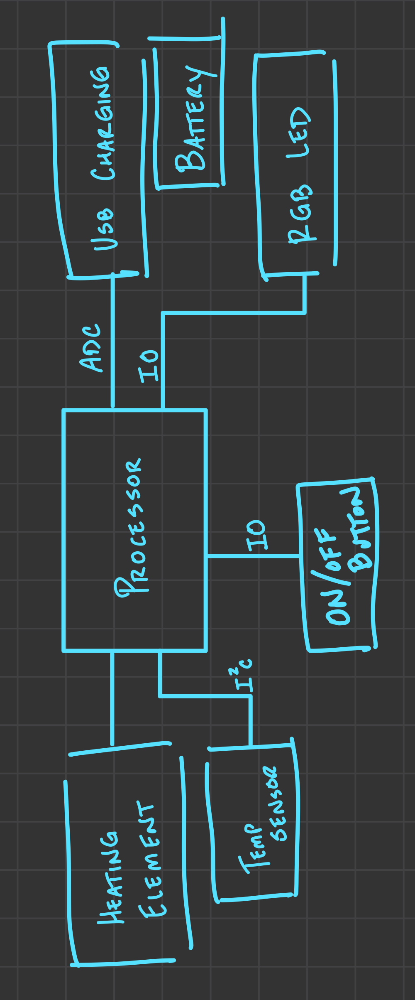
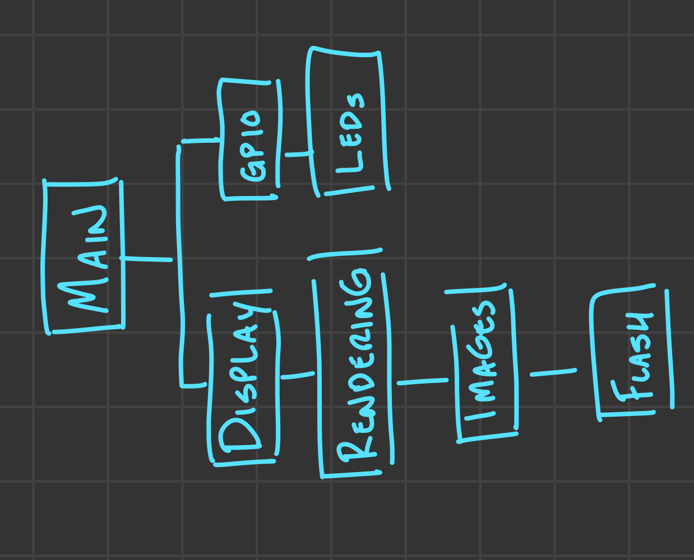

# Exercise 2.1 - Idea Project Diagram

## Self Heating Coffee Mug

I know these exist but I haven't put much thought into how they work before now. This mug would have an internal heating element at the bottom of the mug instead of relying on a external pad. I'm not sure how the heating element would be setup so I left it as a black box.

# Exercise 2.2 - Read Mbed Code and Make Diagram

### Board Overview

#### DISCO-L053C8

This board is a pretty close match to the discovery board I purchased for the class. One reason I chose this board is that it includes an e-ink display. I am still narrowing down my final project idea but it will most likely use some sort of display, so it is nice to see how simple display code works.

#### Demo Code: DISCO-L053C8_ePD_demo

The DISCO-L053C8_ePD_demo displays a picture of a battery on the e-ink display while blinking an LED. In `main` , the code initializes the image and then starts a `while(1)` loop to toggle the LED.

